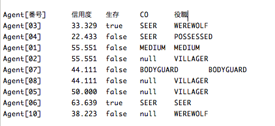

# AIWolfBayesPlayer
ベイジアンネットワークを用いて作成した、人狼知能エージェントです。

**注意**  
未完成です。
村人のみ実装しています。  
村人時の動作としては、ベイジアンネットワークに基づいて各エージェントの信用度を計算し、信用度が一番低いエージェントに投票するだけです。  
利用にはweka.jarが必要になりますので、ビルドパスに追加をしてください。  
正直ベイジアンネットワークというほどネットワークが複雑ではありません。条件付き確率を利用してるだけレベルです。  

[開発者のブログです。](http://informationstudent.blog.fc2.com/blog-entry-28.html "開発者のブログ")weka.jarの入手について等はこちらを参考にしてください。  

**使用しているベイジアンネットワーク**
* attacked2.xml -襲撃された人物が、村人陣営の確率
* newvote2.xml  -<人狼,村人>に投票した人物が、村人陣営の確率。
* seer.xml    -<人狼,村人>判定を下した占い師が、真占い師の確率。真霊能が確定している場合、結果が一致しているかも踏まえる。  

*備考*  
上記３つのネットワークの確率計算結果を元に、信用度(村人陣営だと思う度合い)を算出します。  
ネットワークを生成するために使用したデータは、[簡易人狼](http://kindai-csg.com/member/contents/jinrou/)で集めました。  
人間による８・９人(村2~3,占1,霊1,狩1,狂1,狼2)プレイでのデータのため、人数が違いすぎると有効性が落ちると思われます。  
そのため自分はBayesPlayerを動かす時は１０人で行っています。それ未満だと役職が足りないので。  
霊能者が１人しか出ていない場合は、その人を真霊能として扱います。  
基本的に投票・占い結果と霊能結果のラインで判断することになるため、霊能者に騙りを出されるとあまり判断ができません。  
最初のほうは情報量が少なく、あまりいい判断はできません。

*信用度の変化例*  
  
うまくいった時の一例です。ゲーム終了時での信用度を表示しています。
